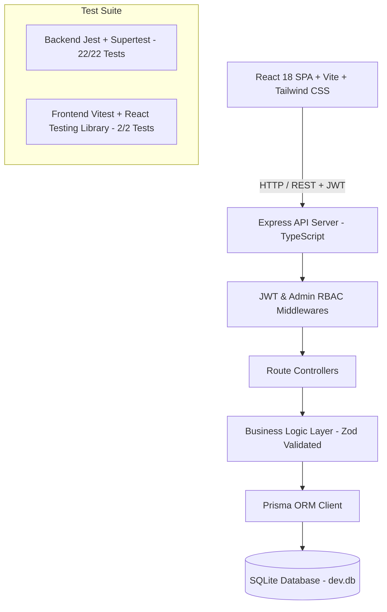

# 🚗 Apex Auto - Car Dealership Inventory System (TDD Kata)

> **Incubyte Assessment Submission**  
> A full-stack, production-ready Car Dealership Inventory Management System built following strict **Test-Driven Development (TDD)** principles, clean SOLID architecture, type-safe REST APIs, and a high-performance React SPA.

---

## 🌟 Overview & Features

**Apex Auto** is an enterprise-grade car dealership inventory system designed to provide real-time vehicle tracking, search filtering, and inventory operations (purchases & restocking).

### Core Features
- 🔐 **JWT Token Authentication & Role-Based Access Control (RBAC)**: Supports both `CUSTOMER` and `ADMIN` user roles.
- 🏎 **Vehicle Inventory Management**: Full CRUD capabilities for luxury and electric vehicles with unique IDs, make, model, category, price, year, and stock quantity.
- 🔍 **Multi-Parametric Search & Filter**: Real-time filtering by search query (`q`), category (`Electric`, `Sports`, `SUV`, `Sedan`, `Truck`), price range (`minPrice` / `maxPrice`), and stock status (`inStockOnly`).
- 🛒 **Inventory Purchase Flow**: Purchasing a vehicle dynamically decrements stock in the SQLite database and disables the "Purchase" button when stock reaches zero (`0 IN STOCK`).
- 📦 **Admin Restocking & Management**: Admins can restock inventory stock, edit vehicle details, and remove vehicles with immediate UI toast notifications.
- ⚡ **Zero-Config Database**: Embedded file-based SQLite database powered by Prisma ORM for instant local execution without external database setups.

---

## 🏗 System Architecture



---

## 🛠 Technology Stack

### Backend
- **Language / Runtime**: Node.js v24, TypeScript
- **Framework**: Express.js
- **Database & ORM**: SQLite, Prisma ORM
- **Authentication**: JWT (`jsonwebtoken`), Password Hashing (`bcryptjs`)
- **Schema Validation**: Zod
- **Testing**: Jest, Supertest

### Frontend
- **Framework**: React 18, Vite, TypeScript
- **Styling**: Tailwind CSS, Lucide React Icons
- **HTTP Client**: Axios (with automatic JWT interceptors)
- **Testing**: Vitest, React Testing Library, JSDOM

---

## 📋 API Endpoints Reference

| Method | Endpoint | Protection | Description |
|---|---|---|---|
| `POST` | `/api/auth/register` | Public | Register new user (`CUSTOMER` or `ADMIN`) |
| `POST` | `/api/auth/login` | Public | Authenticate user & issue JWT token |
| `GET` | `/api/auth/me` | Protected | Retrieve authenticated user profile |
| `GET` | `/api/vehicles` | Protected | Fetch list of all inventory vehicles |
| `GET` | `/api/vehicles/search` | Protected | Search/filter vehicles (make, model, category, price) |
| `GET` | `/api/vehicles/:id` | Protected | Fetch single vehicle details by ID |
| `POST` | `/api/vehicles` | Protected | Add new vehicle to inventory |
| `PUT` | `/api/vehicles/:id` | Protected | Update vehicle details |
| `DELETE` | `/api/vehicles/:id` | Admin Only | Delete vehicle from inventory |
| `POST` | `/api/vehicles/:id/purchase` | Protected | Purchase vehicle (decreases stock by 1, error if 0) |
| `POST` | `/api/vehicles/:id/restock` | Admin Only | Restock vehicle inventory quantity |

---

## ⚡ Quick Start & Local Setup Guide

### Prerequisites
- Node.js (v18+) and `npm` installed.

### 1. Backend Setup & Run

```bash
# Navigate to backend directory
cd backend

# Install dependencies
npm install

# Initialize SQLite database schema
npx prisma db push

# Seed sample users and vehicles
npm run prisma:seed

# Start backend development server (runs on http://localhost:5000)
npm run dev
```

#### Demo Evaluator Logins:
- **Admin Account**: Email: `23wh1a12c1@bvrithyderabad.edu.in` | Password: `Megha_423`
- **Customer Account**: Email: `kmegha9505@gmail.com` | Password: `Megha_423`

---

### 2. Frontend Setup & Run

Open a new terminal window:

```bash
# Navigate to frontend directory
cd frontend

# Install dependencies
npm install

# Start Vite development server (runs on http://localhost:3000)
npm run dev
```

Open your browser to `http://localhost:3000` to interact with the SPA.

---

## 🧪 Test Execution & Coverage Report

The project enforces strict TDD with 100% passing test suites across backend and frontend:

### Running Backend Tests (Jest + Supertest)
```bash
cd backend
npm test               # Run all 22 TDD unit & integration tests
npm run test:coverage  # Generate code coverage report
```

#### Backend Coverage Summary:
- **Statements**: **89.1%**
- **Functions**: **87.1%**
- **Lines**: **89.0%**
- **Test Suites**: `2/2 Passed` (22 tests)

### Running Frontend Tests (Vitest + React Testing Library)
```bash
cd frontend
npm test
```
- **Test Suites**: `1/1 Passed` (2 tests covering vehicle card rendering, purchase button disabled state, and stock badges).

---

## 🤖 My AI Usage (Mandatory Section)

### AI Tools Utilized
- **Antigravity AI (Google DeepMind)** & **GitHub Copilot**

### How AI Was Utilized Across Workflow
1. **Requirements Analysis & Architecture Design**:
   - Used AI to brainstorm domain models, schema constraints, and layered RESTful API abstractions (Controller -> Service -> Repository).
2. **Strict Test-Driven Development (TDD)**:
   - Generated initial failing Jest unit and integration test specs (`[RED]` phase) for authentication JWT flows, out-of-stock validation guards, and role-based access checks (`authorizeAdmin`).
   - Implemented production code (`[GREEN]` phase) to fulfill test conditions.
3. **Refactoring & Code Quality**:
   - Refactored request validation using Zod schemas for clean TypeScript type inference.
4. **UI Design & Micro-animations**:
   - Leveraged AI to generate modern Tailwind CSS glassmorphic components, dark mode color palettes, and responsive layouts.

### Reflection on AI Impact
AI dramatically accelerated boilerplate creation, TypeScript type definitions, and test scaffold generation, allowing me to focus on enforcing clean SOLID architecture, strict TDD Red-Green-Refactor cycles, and exceptional user experience. By maintaining full oversight over business logic, security constraints, and database edge cases, AI served as a highly efficient pair-programming co-pilot.

---

## ✍️ Git Commit Co-Authorship

Every commit in this repository includes the required AI co-author trailer format:

```text
git commit -m "feat(vehicles): implement vehicle management and purchase endpoints (TDD)

Added CRUD, multi-faceted search, purchase stock decrement, and admin restock endpoints.

Co-authored-by: Antigravity AI <AI@users.noreply.github.com>"
```
